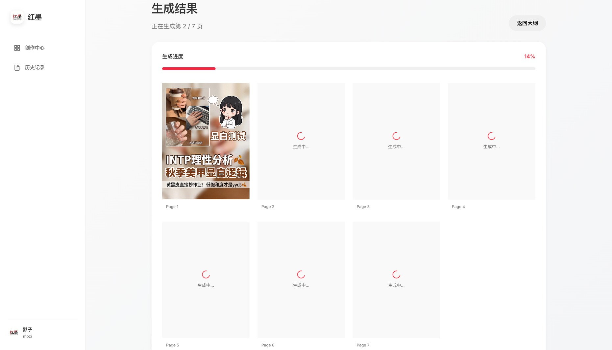

<div align="center">


## 黑虎AI官方站点上线啦，注册即送50体验积分！

## 注册需要邀请码！可以到 https://watcha.cn/square/discuss#post_id=1380 获取

<div align="center">
<a href="https://redink.top">
  
</a>

#### [点击访问在线体验站 → Redink.top](https://redink.top)


</div>


<sub>*使用黑虎AI生成的各类小红书封面 - AI驱动，风格统一，文字准确*</sub>

</div>

---

## ✨ 效果展示

### 输入一句话，生成完整图文

<details open>
<summary><b>Step 1: 智能大纲生成</b></summary>

<br>


**功能特性：**
- ✏️ 可编辑每页内容
- 🔄 可调整页面顺序（不建议）
- ✨ 自定义每页描述（强烈推荐）

</details>

<details open>
<summary><b>🎨 Step 2: 封面页生成</b></summary>

<br>



**封面亮点：**
- 🎯 符合个人风格
- 📝 文字准确无误
- 🌈 视觉统一协调

</details>

<details open>
<summary><b>📚 Step 3: 内容页批量生成</b></summary>

<br>


**生成说明：**
- ⚡ 并发生成所有页面（默认最多 15 张）
- ⚠️ 如 API 不支持高并发，请在设置中关闭
- 🔧 支持单独重新生成不满意的页面

</details>

---

## 🏗️ 技术架构

<table>
<tr>
<td width="50%" valign="top">

### 🔧 后端技术栈

| 技术 | 说明 |
|------|------|
| **语言** | Python 3.11+ |
| **框架** | Flask |
| **包管理** | uv |
| **文案AI** | Gemini 3 |
| **图片AI** | 🍌 Nano banana Pro |

</td>
<td width="50%" valign="top">

### 🎨 前端技术栈

| 技术 | 说明 |
|------|------|
| **框架** | Vue 3 + TypeScript |
| **构建工具** | Vite |
| **状态管理** | Pinia |
| **样式** | Modern CSS |

</td>
</tr>
</table>

---

## 📦 如何自己部署

### 方式一：Docker 部署（推荐）

**最简单的部署方式，一行命令即可启动：**

```bash
docker run -d -p 12398:12398 -v ./history:/app/history -v ./output:/app/output histonemax/blacktigerai:latest
```

访问 http://localhost:12398，在 Web 界面的**设置页面**配置你的 API Key 即可使用。

**使用 docker-compose（可选）：**

下载 [docker-compose.yml](https://github.com/HisMax/BlackTigerAI/blob/main/docker-compose.yml) 后：

```bash
docker-compose up -d
```

**Docker 部署说明：**
- 容器内不包含任何 API Key，需要在 Web 界面配置
- 使用 `-v ./history:/app/history` 持久化历史记录
- 使用 `-v ./output:/app/output` 持久化生成的图片
- 可选：挂载自定义配置文件 `-v ./text_providers.yaml:/app/text_providers.yaml`

---

### 方式二：本地开发部署

**前置要求：**
- Python 3.11+
- Node.js 18+
- pnpm
- uv

### 1. 克隆项目
```bash
git clone https://github.com/HisMax/BlackTigerAI.git
cd BlackTigerAI
```

### 2. 配置 API 服务

复制配置模板文件：
```bash
cp text_providers.yaml.example text_providers.yaml
cp image_providers.yaml.example image_providers.yaml
```

编辑配置文件，填入你的 API Key 和服务配置。也可以启动后在 Web 界面的**设置页面**进行配置。

### 3. 安装后端依赖
```bash
uv sync
```

### 4. 安装前端依赖
```bash
cd frontend
pnpm install
```

### 5. 启动服务

#### 一键启动（推荐）

双击运行启动脚本，自动安装依赖并启动前后端：

- **macOS**: `start.sh` 或双击 `scripts/start-macos.command`
- **Linux**: `./start.sh`
- **Windows**: 双击 `start.bat`

启动后自动打开浏览器访问 http://localhost:5173

#### 手动启动

**启动后端:**
```bash
uv run python -m backend.app
```
访问: http://localhost:12398

**启动前端:**
```bash
cd frontend
pnpm dev
```
访问: http://localhost:5173

---

## 🔧 配置说明

### 配置方式

项目支持两种配置方式：

1. **Web 界面配置（推荐）**：启动服务后，在设置页面可视化配置
2. **YAML 文件配置**：直接编辑配置文件

### 文本生成配置

配置文件: `text_providers.yaml`

```yaml
# 当前激活的服务商
active_provider: openai

providers:
  # OpenAI 官方或兼容接口
  openai:
    type: openai_compatible
    api_key: sk-xxxxxxxxxxxxxxxxxxxx
    base_url: https://api.openai.com/v1
    model: gpt-4o

  # Google Gemini（原生接口）
  gemini:
    type: google_gemini
    api_key: AIzaxxxxxxxxxxxxxxxxxxxxxxxxx
    model: gemini-2.0-flash
```

### 图片生成配置

配置文件: `image_providers.yaml`

```yaml
# 当前激活的服务商
active_provider: gemini

providers:
  # Google Gemini 图片生成
  gemini:
    type: google_genai
    api_key: AIzaxxxxxxxxxxxxxxxxxxxxxxxxx
    model: gemini-3-pro-image-preview
    high_concurrency: false  # 高并发模式

  # OpenAI 兼容接口
  openai_image:
    type: image_api
    api_key: sk-xxxxxxxxxxxxxxxxxxxx
    base_url: https://your-api-endpoint.com
    model: dall-e-3
    high_concurrency: false
```

### 高并发模式说明

- **关闭（默认）**：图片逐张生成，适合 GCP 300$ 试用账号或有速率限制的 API
- **开启**：图片并行生成（最多15张同时），速度更快，但需要 API 支持高并发

⚠️ **GCP 300$ 试用账号不建议启用高并发**，可能会触发速率限制导致生成失败。

---

## ⚠️ 注意事项

1. **API 配额限制**:
   - 注意 Gemini 和图片生成 API 的调用配额
   - GCP 试用账号建议关闭高并发模式

2. **生成时间**:
   - 图片生成需要时间,请耐心等待（不要离开页面）

---

## 🤝 参与贡献

欢迎提交 Issue 和 Pull Request!

如果这个项目对你有帮助,欢迎给个 Star ⭐


---

## 更新日志

### v1.4.1 (2025-12-29)
- ✨ 新增一键启动脚本，支持 macOS/Linux/Windows
- ✨ 新增文案生成功能，自动生成标题、正文和标签
- 🔧 修复历史记录保存机制：大纲生成后立即保存，编辑时自动保存（300ms防抖）
- 🔧 优化跳转逻辑：点击"开始生成"前强制保存未保存的修改
- 🔧 统一启动脚本端口显示为 12398
- 🔧 清理后端生成器未使用的重试装饰器代码
- 🔧 修复前端 CSS 变量引用问题
- 🔧 优化 checkHistoryExists 接口性能，使用专用端点
- 🔧 规范 recordId 赋值方式，统一使用 setRecordId() 方法

### v1.4.0 (2025-11-30)
- 🏗️ 后端架构重构：拆分单体路由为模块化蓝图（history、images、generation、outline、config）
- 🏗️ 前端组件重构：提取可复用组件（ImageGalleryModal、OutlineModal、ShowcaseBackground等）
- ✨ 优化首页设计，移除冗余内容区块
- ✨ 背景图片预加载和渐入动画，提升加载体验
- ✨ 历史记录持久化支持（Docker部署）
- 🔧 修复历史记录预览和大纲查看功能
- 🔧 优化Modal组件可见性控制
- 🧪 新增65个后端单元测试

### v1.3.0 (2025-11-26)
- ✨ 新增 Docker 支持，一键部署
- ✨ 发布官方 Docker 镜像到 Docker Hub: `histonemax/redink`
- 🔧 Flask 自动检测前端构建产物，支持单容器部署
- 🔧 Docker 镜像内置空白配置模板，保护 API Key 安全
- 📝 更新 README，添加 Docker 部署说明

### v1.2.0 (2025-11-26)
- ✨ 新增版权信息展示，所有页面显示开源协议和项目链接
- ✨ 优化图片重新生成功能，支持单张图片重绘
- ✨ 重新生成图片时保持风格一致，传递完整上下文（封面图、大纲、用户输入）
- ✨ 修复图片缓存问题，重新生成的图片立即刷新显示
- ✨ 统一文本生成客户端接口，支持 Google Gemini 和 OpenAI 兼容接口自动切换
- ✨ 新增 Web 界面配置功能，可视化管理 API 服务商
- ✨ 新增高并发模式开关，适配不同 API 配额
- ✨ API Key 脱敏显示，保护密钥安全
- ✨ 配置自动保存，修改即时生效
- 🔧 调整默认 max_output_tokens 为 8000，兼容更多模型限制
- 🔧 优化前端路由和页面布局，提升用户体验
- 🔧 简化配置文件结构，移除冗余参数
- 🔧 优化历史记录图片显示，使用缩略图节省带宽
- 🔧 历史记录重新生成时自动从文件系统加载封面图作为参考
- 🐛 修复 `store.updateImage` 方法缺失导致的重新生成失败问题
- 🐛 修复历史记录加载时图片 URL 拼接错误
- 🐛 修复下载功能中原图参数处理问题
- 🐛 修复图片加载 500 错误问题

---

## 交流讨论与赞助

- **GitHub Issues**: [https://github.com/HisMax/BlackTigerAI/issues](https://github.com/HisMax/BlackTigerAI/issues)

### 联系作者

- **Email**: histonemax@gmail.com
- **微信**: Histone2024（添加请注明来意）
- **GitHub**: [@HisMax](https://github.com/HisMax)

### 用爱发电，如果可以，请默子喝一杯☕️咖啡吧


## Star History

[](https://star-history.com/#HisMax/BlackTigerAI&Date)

---

## 📄 开源协议

### 个人使用 - CC BY-NC-SA 4.0

本项目采用 [CC BY-NC-SA 4.0](https://creativecommons.org/licenses/by-nc-sa/4.0/) 协议进行开源

**你可以自由地：**
- ✅ **个人使用** - 用于学习、研究、个人项目
- ✅ **分享** - 在任何媒介以任何形式复制、发行本作品
- ✅ **修改** - 修改、转换或以本作品为基础进行创作

**但需要遵守以下条款：**
- 📝 **署名** - 必须给出适当的署名，提供指向本协议的链接，同时标明是否对原始作品作了修改
- 🚫 **非商业性使用** - 不得将本作品用于商业目的
- 🔄 **相同方式共享** - 如果你修改、转换或以本作品为基础进行创作，你必须以相同的协议分发你的作品

### 商业授权

如果你希望将本项目用于**商业目的**（包括但不限于）：
- 提供付费服务
- 集成到商业产品
- 作为 SaaS 服务运营
- 其他盈利性用途

**请联系作者获取商业授权：**
- 📧 Email: histonemax@gmail.com
- 💬 微信: Histone2024（请注明"商业授权咨询"）

默子会根据你的具体使用场景提供灵活的商业授权方案。

---

### 免责声明

本软件按"原样"提供，不提供任何形式的明示或暗示担保，包括但不限于适销性、特定用途的适用性和非侵权性的担保。在任何情况下，作者或版权持有人均不对任何索赔、损害或其他责任负责。

---

## 🙏 致谢

- [Google Gemini](https://ai.google.dev/) - 强大的文案生成能力
- 图片生成服务提供商 - 惊艳的图片生成效果
- [Linux.do](https://linux.do/) - 优秀的开发者社区

---

## 👨‍💻 作者

**默子 (Histone)** - AI 创业者 

- 🏠 位置: 中国杭州
- 🚀 状态: 创业中
- 📧 Email: histonemax@gmail.com
- 💬 微信: Histone2024 （私人微信不解答任何技术问题）
- 🐙 GitHub: [@HisMax](https://github.com/HisMax)
- 

*"让 AI 帮我们做更有创造力的事"*

---

**如果这个项目帮到了你,欢迎分享给更多人!** ⭐

有任何问题或建议,欢迎提 Issue !
